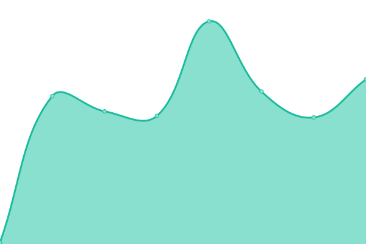
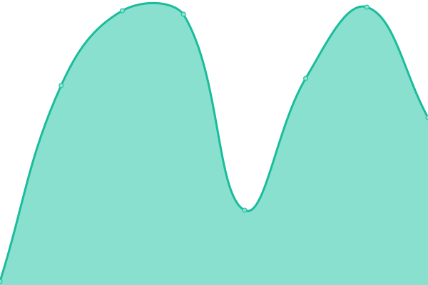

# [📈 Live Status](https://github.ewelinkcommunity.net): <!--live status--> **🟩 All systems operational**

This repository contains the open-source uptime monitor and status page for [eWeLink Community Website](https://ewelinkcommunity.net), powered by [Upptime](https://github.com/upptime/upptime).

With [Upptime](https://upptime.js.org), you can get your own unlimited and free uptime monitor and status page, powered entirely by a GitHub repository. We use [Issues](https://github.com/ewelinkcommunity/upptime/issues) as incident reports, [Actions](https://github.com/ewelinkcommunity/upptime/actions) as uptime monitors, and [Pages](https://github.ewelinkcommunity.net) for the status page.

<!--start: status pages-->
<!-- This summary is generated by Upptime (https://github.com/upptime/upptime) -->
<!-- Do not edit this manually, your changes will be overwritten -->
<!-- prettier-ignore -->
| URL | Status | History | Response Time | Uptime |
| --- | ------ | ------- | ------------- | ------ |
|  [eWeLink Community Website](ewelinkcommunity.net) | 🟩 Up | [e-we-link-community-website.yml](https://github.com/ewelinkcommunity/upptime/commits/HEAD/history/e-we-link-community-website.yml) | 

 91ms
     
 | 

<a href="https://github.ewelinkcommunity.net/history/e-we-link-community-website">100.00%</a>
    

|  eWeLink server Europe | 🟩 Up | [e-we-link-server-europe.yml](https://github.com/ewelinkcommunity/upptime/commits/HEAD/history/e-we-link-server-europe.yml) | 

 100ms
     
 | 

<a href="https://github.ewelinkcommunity.net/history/e-we-link-server-europe">100.00%</a>
    

|  eWeLink server America & Australia | 🟩 Up | [e-we-link-server-america-and-australia.yml](https://github.com/ewelinkcommunity/upptime/commits/HEAD/history/e-we-link-server-america-and-australia.yml) | 

 75ms
     
 | 

<a href="https://github.ewelinkcommunity.net/history/e-we-link-server-america-and-australia">100.00%</a>
    

|  eWeLink server China | 🟩 Up | [e-we-link-server-china.yml](https://github.com/ewelinkcommunity/upptime/commits/HEAD/history/e-we-link-server-china.yml) | 

 219ms
     
 | 

<a href="https://github.ewelinkcommunity.net/history/e-we-link-server-china">100.00%</a>
    

|  eWeLink server Asia | 🟩 Up | [e-we-link-server-asia.yml](https://github.com/ewelinkcommunity/upptime/commits/HEAD/history/e-we-link-server-asia.yml) | 

 218ms
     
 | 

<a href="https://github.ewelinkcommunity.net/history/e-we-link-server-asia">100.00%</a>
    

<!--end: status pages-->

[**Visit our status website →**](https://github.ewelinkcommunity.net)

## 📄 License

- Powered by: [Upptime](https://github.com/upptime/upptime)
- Code: [MIT](./LICENSE) © [Anand Chowdhary](https://anandchowdhary.com), supported by [Pabio](https://pabio.com)
- Data in the `./history` directory: [Open Database License](https://opendatacommons.org/licenses/odbl/1-0/)
